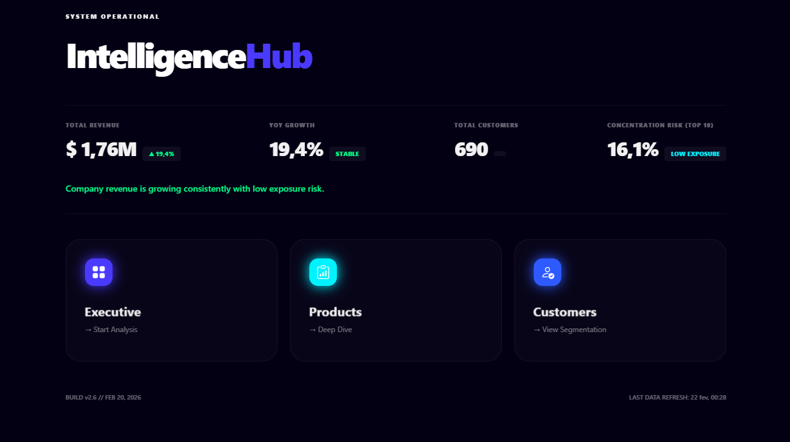
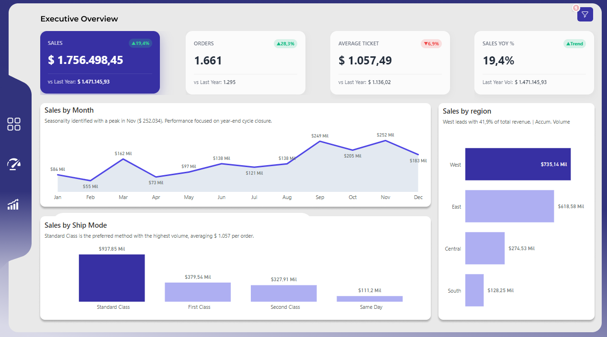
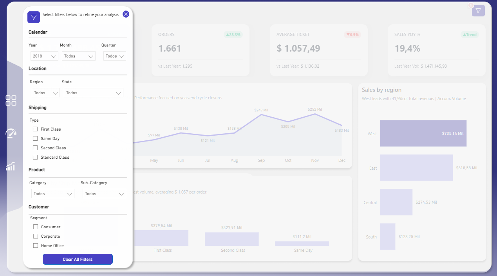
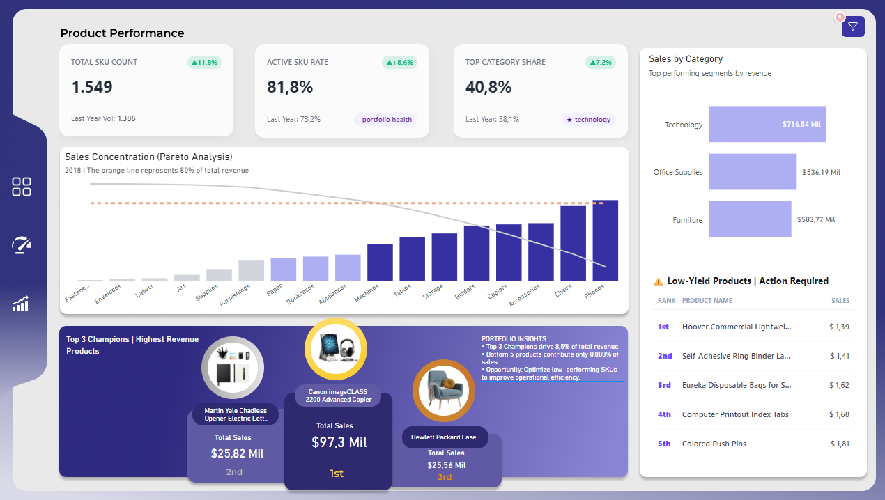
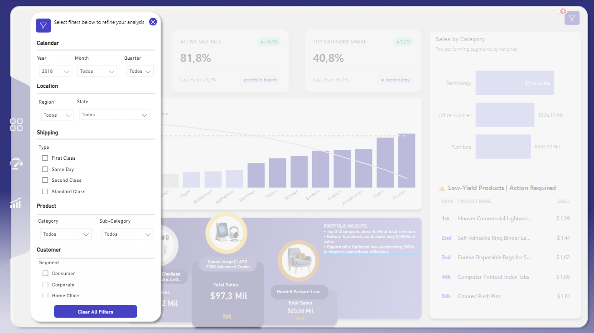
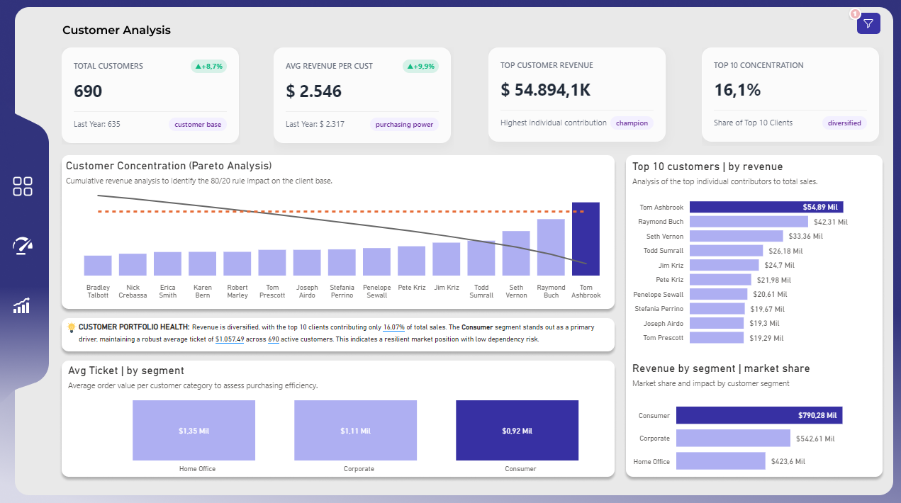
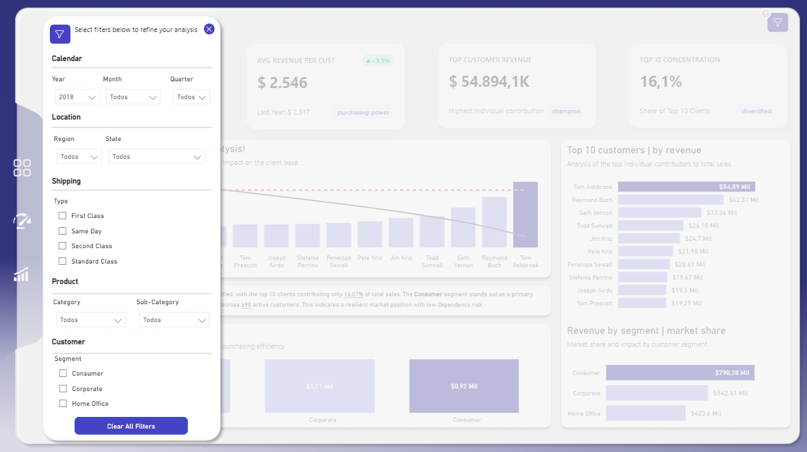
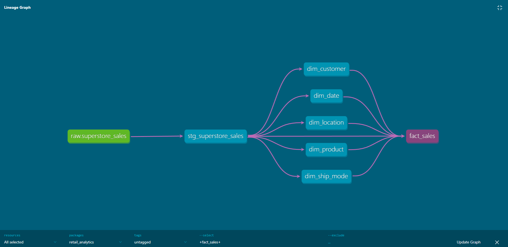

# Retail Analytics Warehouse

## 📌 Business Context
This project simulates a global retail company centralizing transactional sales data into a dimensional data warehouse to support business intelligence and strategic decision-making. 
The dataset represents four years of retail operations including orders, customers, products, shipping information, and geographic attributes.

## 🎯 Objective
Design and implement a dimensional data model optimized for analytical workloads and BI consumption using a layered transformation architecture with data quality validation.

## 📊 Power BI Visualization Layer (Intelligence Hub)
The final dimensional model is consumed by a high-performance Power BI Dashboard, designed with a focus on UX and advanced analytical features:

* **Intelligence Hub Architecture:** A centralized entry point (Home) that connects three specialized dashboards: Executive Overview, Product Performance, and Customer Analysis.
* **Advanced Navigation:** Implementation of page-specific bookmarks for synchronized filter menus, ensuring a fluid experience without "page-jumping".
* **Smart Filtering System:** * **Synchronized Slicers:** Filters applied in one view are carried across the entire report seamlessly.
    * **Custom Filter Badge (HTML/DAX):** A dynamic indicator that counts and identifies active filters, improving user context and navigation.
* **Performance:** Optimized using **Import Mode** for sub-second query response times.

### 📸 Dashboard Preview
| Home (Intelligence Hub) | Filter Menu & UI Details |
| :--- | :--- |
|  | 
|  |  |
|  |  |
|  |  |


## 🏗️ Architecture
The project follows a layered architecture inspired by the Medallion pattern:
* **Raw layer** – Source ingestion.
* **Staging layer** – Data cleaning and standardization.
* **Marts layer** – Dimensional star schema (Fact and Dimensions).

### 🔗 Data Lineage (dbt)
The following lineage graph illustrates the end-to-end data flow, from raw ingestion to the final dimensional model. This architecture ensures modularity and clear data ownership.


## 📊 Fact Table Grain
One row represents a single product item within a specific order. This ensures accurate revenue aggregation and enables product-level, customer-level, geographic, and time-based analysis without ambiguity.

## 📐 Dimensions & Modeling
* **SCD Type 1:** `dim_customer`, `dim_product`, `dim_date`, `dim_location`, `dim_ship_mode`.
* **Surrogate Keys:** Implemented for all dimensions to ensure historical integrity and join performance.
* **Referential Integrity:** Enforced using dbt relationship tests.

## 🧪 Data Quality & Testing
* **Schema Validation:** Data quality is enforced using dbt tests (not_null, unique, and relationships).
* **Referential Integrity:** Guaranteed between fact and dimension tables through dbt constraints.

## 🛠️ Tech Stack
* **PostgreSQL** (Data Warehouse)
* **dbt** (Data Transformation & Testing)
* **Power BI** (Advanced Data Visualization & DAX)
* **Git & GitHub** (Version Control)

## 📁 Project Structure
```text
models/
├── staging/
│   └── stg_superstore_sales.sql
└── marts/
    ├── dim_customer.sql
    ├── dim_date.sql
    ├── dim_location.sql
    ├── dim_product.sql
    ├── dim_ship_mode.sql
    └── fact_sales.sql
docs/
└── screenshots/ (Dashboard previews)

📌 Future Improvements
Implement SCD Type 2 using dbt snapshots.

Introduce incremental models for large-scale data handling.

Deploy orchestration workflow (Airflow/GitHub Actions)...